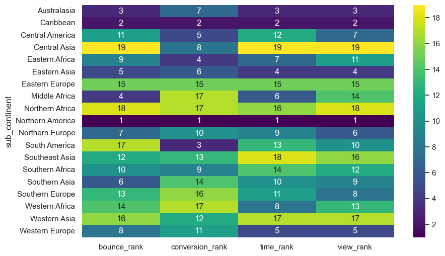
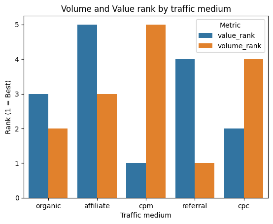

# Google Analytics Data Analysis

## Research Questions

1. What geographic and traffic sources are driving consumer spending on products?
2. What are some areas to focus on for further expansion?

**Data Source:** Google Analytics data (BigQuery)

**Tools Used:**
1. BigQuery
2. SQL
3. Python
4. Matplotlib
5. Pandas

---

### Which Sub Continent ranked in market metrics?


> **NOTE:** In the above chart, lower means better.

> **Methodology:** Used BigQuery to query data and used window function to rank sub continent by bounce rate, conversion rate, time spent by customer's on the site, and number of views.

**North America:** North America ranks 1st in every metric, where consumers are engaging with the website and making purchases. This is the highest-performing market and should be prioritized.

**Central Asia:** In Central Asia, the majority of the consumers aren't browsing the website, ranking 19th in bounce rate, with the few consumers who are staying making purchases. Indicating that only a few consumers make purchases in larger volume.

**Eastern Asia:** Eastern Asian consumers are balanced, with rankings ranging from 4 to 6 in the categories, suggesting balanced consumer behavior.

**South America:** South America shows weak engagement, being ranked 17th, but a stronger conversion rate, with a rank of 3. This suggests that the majority of the consumers have already made the choice of the product to purchase. This suggests that there should be a focus on marketing to target intent-driven visitors.

---

### Which consumer group provided more value by volume?

> **Methodology:**
> Used bigquery to query data , with the use of window function and CTE to calculate the total revenue per visit

```sql
WITH high_value AS (
  SELECT
    IFNULL(SUM(totals.transactionRevenue), 0) / 1000000 AS total_revenue,
    IFNULL(SUM(totals.visits), 0) AS total_visits,
    IFNULL((SUM(totals.transactionRevenue) / 1000000) / NULLIF(SUM(totals.visits), 0), 0) AS revenue_per_visit,
    trafficSource.medium AS traffic_medium
  FROM `bigquery-public-data.google_analytics_sample.ga_sessions_*`
  WHERE _TABLE_SUFFIX BETWEEN '20160801' AND '20170131' 
    AND trafficSource.medium NOT IN ('(none)', '(not set)')
  GROUP BY trafficSource.medium
)
SELECT *,
  RANK() OVER(ORDER BY revenue_per_visit DESC) AS value_rank,
  RANK() OVER(ORDER BY total_visits DESC) AS volume_rank
FROM high_value;
```

### Volume and value comparison by traffic medium



**CPM**: CPM has the highest revenue per visit, but the number of visitors is lacking. There is a significant difference between the value (revenue per visit) and volume (total number of visits), suggesting high visitor conversion but lacking in the number of visitors to the site.

**Referral**: While referral is the source of most of the visitors, it lacks quality of visitors, with a ranking of 4 out of 5. Suggesting the need to implement a referral bonus to increase the conversion rate.

CPM and CPC are the only mediums where the value rank is higher in comparison to volume rank; suggestions lack the number of visitors but have higher visitor conversion than others.
