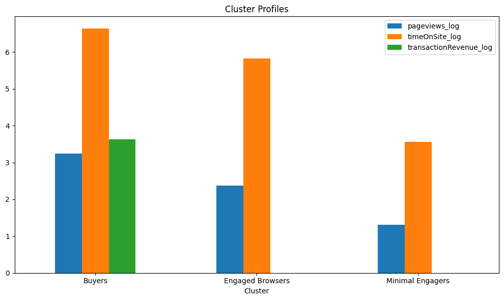

# Google Analytics Data Analysis

## Research Questions

1. What geographic and traffic sources are driving consumer spending on products?
2. What are some areas to focus on for further expansion?

**Data Source:** Google Analytics data (BigQuery)

**Tools Used:**
1. BigQuery
2. SQL
3. Python
4. Matplotlib
5. Pandas

---

### Which Sub Continent ranked in market metrics?


> **NOTE:** In the above chart, lower means better.

> **Methodology:** Used BigQuery to query data and used window function to rank sub continent by bounce rate, conversion rate, time spent by customer's on the site, and number of views.

**North America:** North America ranks 1st in every metric, where consumers are engaging with the website and making purchases. This is the highest-performing market and should be prioritized.

**Central Asia:** In Central Asia, the majority of the consumers aren't browsing the website, ranking 19th in bounce ranking, with the few consumers who are staying making purchases. Indicating that only a few consumers make purchases in larger volume.

**Eastern Asia:** Eastern Asian consumers are balanced, with rankings ranging from 4 to 6 in the categories, suggesting balanced consumer behavior.

**South America:** South America shows weak engagement, being ranked 17th, but a stronger conversion rate, with a rank of 3. This suggests that the majority of the consumers have already made the choice of the product to purchase. This suggests that there should be a focus on marketing to target intent-driven visitors.

---

### Which consumer group provided more value by volume?

> **Methodology:**
> Used bigquery to query data , with the use of window function and CTE to calculate the total revenue per visit

```sql
WITH high_value AS (
  SELECT
    IFNULL(SUM(totals.transactionRevenue), 0) / 1000000 AS total_revenue,
    IFNULL(SUM(totals.visits), 0) AS total_visits,
    IFNULL((SUM(totals.transactionRevenue) / 1000000) / NULLIF(SUM(totals.visits), 0), 0) AS revenue_per_visit,
    trafficSource.medium AS traffic_medium
  FROM `bigquery-public-data.google_analytics_sample.ga_sessions_*`
  WHERE _TABLE_SUFFIX BETWEEN '20160801' AND '20170131' 
    AND trafficSource.medium NOT IN ('(none)', '(not set)')
  GROUP BY trafficSource.medium
)
SELECT *,
  RANK() OVER(ORDER BY revenue_per_visit DESC) AS value_rank,
  RANK() OVER(ORDER BY total_visits DESC) AS volume_rank
FROM high_value;
```

### Volume and value comparison by traffic medium


**CPM**: CPM has the highest revenue per visit , but the number visitor is lackinng. There is significant difference between the value (Revenue per visit) and volume(Total number of visits), suggesting high visitor conversion , but lacking in number of visitor to the site.

**Referral**: While referral is the source of most of the visitors, but it lacks in quality of visitors , with ranking of 4 out of 5. Suggesting the need to implement refferal bonus to increase conversion rate.

CPM , CPC. are the only medium where the value rank is higher incomparison to volume rank, suuggestion both lacks the number of visitors , but higher visitor conversion than others.


### Customer Segmentation:


From Kmeans Clustering(k=3), identified  that majority of sessions falls into low or moderate engagement with little to no conversion. With only the customer segment with highest engagement made most transactions than others.

We can distinguish three different segment of customers 

1. Engaged browsers : The customers who engage with the website but make minimal purchases 
2. Minimal engageers : The customers who engage less, with little to no purchase

3. Buyers : These are the active customer segment , who engages and makes purchases, having the highest engagement metric and purchase 
<div>
<style scoped>
    .dataframe tbody tr th:only-of-type {
        vertical-align: middle;
    }

    .dataframe tbody tr th {
        vertical-align: top;
    }

    .dataframe thead th {
        text-align: right;
    }
</style>
<table border="1" class="dataframe">
  <thead>
    <tr style="text-align: right;">
      <th>labels</th>
      <th>Buyers</th>
      <th>Engaged Browsers</th>
      <th>Minimal Engagers</th>
    </tr>
    <tr>
      <th>subContinent</th>
      <th></th>
      <th></th>
      <th></th>
    </tr>
  </thead>
  <tbody>
    <tr>
      <th>Northern America</th>
      <td>1712</td>
      <td>19760</td>
      <td>23060</td>
    </tr>
    <tr>
      <th>South America</th>
      <td>15</td>
      <td>684</td>
      <td>2343</td>
    </tr>
    <tr>
      <th>Eastern Asia</th>
      <td>10</td>
      <td>1277</td>
      <td>2257</td>
    </tr>
    <tr>
      <th>Central America</th>
      <td>6</td>
      <td>310</td>
      <td>1062</td>
    </tr>
    <tr>
      <th>Western Asia</th>
      <td>4</td>
      <td>483</td>
      <td>2912</td>
    </tr>
  </tbody>
</table>
</div>
